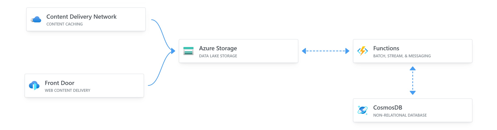

# Projects Explanation, Implementation and Execution.

## [1. Static WebSite deployment and hosting on Azure Blob Storage.](https://github.com/satishvermacoen/Azure-Projects/tree/main/1.%20Static%20WebSite%20deployment%20and%20hosting%20on%20Azure%20Blob%20Storage)
In this Project, a Deployment of a Static website(My Resume) hosted on an Azure Storage account and using Azure blob storage. After pointing it to the domain name.
### Click here to Go live [satishverma.co](http://satishvermacloudlearning.shop)

## [2. Azure VM Deployment with cloud init.](https://github.com/satishvermacoen/Azure-Projects/tree/main/2.%20Azure%20VM%20Deployment%20with%20cloud%20init)
In this Project, a Deployment of a Azure VM(linux sever) with pre confingured webserver. In this used- Git, nginx, cli, bash, Azure Virtual Machine, Azure Virtual Network, Azure DNS, Domain name system.
### OVERVIEW

## [3. How to Integration with Azure Monitor Azure Virtual Machines (VMs Linux)](https://github.com/satishvermacoen/Azure-Projects/tree/main/3.%20VM%20Integration%20with%20Azure%20monitor%20and%20Log%20Analytics%20workspace)
Integrating Azure Monitor with Azure Virtual Machines (VMs) running Linux involves configuring the Azure Monitor Agent on the VMs. The Azure Monitor Agent collects performance data, logs, and other telemetry from the VMs and sends this data to Azure Monitor. Here are the steps to integrate Azure Monitor with Azure VMs running Linux.
### OVERVIEW

-------------------------------
## [4. loop vm depoyment](https://github.com/satishvermacoen/Azure-Projects/tree/main//4.%20loop%20vm%20depoyment)

-------------------------------
## [5. Azure-Cloud-Resume](https://github.com/satishvermacoen/Azure-Cloud-Resume.git)

This is my Cloud Resume Challenge built on Azure. It's a static website hosted on Azure Storage, with a visitor counter built on Azure Functions. The website is built with HTML, CSS, and JavaScript. The visitor counter is built with .NET and Azure Functions. 

If you'd like to build your own, here is the YouTube video [video](https://youtu.be/ieYrBWmkfno) 

## Demo

View it live here(https://www.satishverma.cloud/)

### More on the Way............